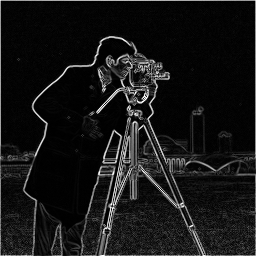
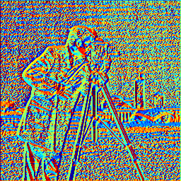

# Image Gradient Calculation

## Introduction
This code calculates the gradient of the given 'cameraman.tif' image using the `imfilter()` function (or `convolve()` and `correlate()` functions). It visualizes the partial derivatives dI/dx, dI/dy, the magnitude of the gradient, and the orientation of the gradient.

### Instructions
Given the ‘cameraman.tif” image as I, use `imfilter()` function (or `convolve()` and `correlate()` functions) to calculate the gradient. Visualize the dI/dx, dI/dy, the magnitude of the gradient, and the orientation of the gradient. Note: `imread()`, `double()`, `uint8()`, `imshow()`, `imagesc()` are some functions for I/O, data format conversion, and visualization.

## Code Description
The provided code:

- Reads the 'cameraman.tif' image and converts it to double format.
- Applies convolution using vertical and horizontal edge kernels to calculate the gradients dI/dx and dI/dy respectively.
- Computes the magnitude and orientation of the gradient based on the calculated gradients.
- Visualizes the gradients dI/dx, dI/dy, the magnitude of the gradient, and the orientation of the gradient using `imshow()` and `imagesc()` functions.

## Results

The following images demonstrate the transformation of the original 'cameraman.tif' image into its edge-recognized components:

1\. **dI/dy (Vertical Edges)** 

   
   This image highlights the vertical edges of the original image. Areas with strong vertical changes in intensity appear as high values, showing where vertical edges are detected.

2\. **dI/dx (Horizontal Edges)** 
   
   
   This image highlights the horizontal edges of the original image. Areas with strong horizontal changes in intensity appear as high values, indicating where horizontal edges are present.

3\. **Gradient Magnitude** 
   
   
   The gradient magnitude combines the vertical and horizontal gradients to show the overall intensity of edges in the image. High values indicate areas with strong edges, regardless of their orientation.

4\. **Gradient Orientation** 
   
   
   This image represents the orientation of the gradients. The colors indicate the direction of the edges, with different colors corresponding to different angles. This helps in understanding the directionality of the edges detected in the image.

## Installation
1. Clone this repository.
2. Ensure MATLAB is installed on your system.
3. Place the 'cameraman.tif' image in the same directory as the script.
4. Run the script in MATLAB.
