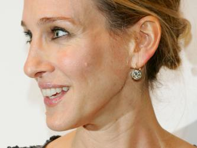

# Image Filtering Script

This script demonstrates various types of image filtering techniques applied to images using MATLAB.

## Part 1: Box Filtering
- Applies a 3x3 and 5x5 box filter to the 'cameraman.tif' image.
- Visualizes the results of box filtering.

## Part 2: Gaussian Filtering
- Applies Gaussian filtering with different sigma values to the 'cameraman.tif' image.
- Visualizes the results of Gaussian filtering.

## Part 3: Bilateral Filtering
- Applies bilateral filtering to the 'sarah.jpg' image.
- Allows for adjusting the sigma_spatial and sigma_intensity parameters.
- Visualizes the results of bilateral filtering.

## Result

### Part 1: Box Filtering

The box filter smooths the image by averaging the pixel values within a specified neighborhood. The larger the box filter, the more significant the smoothing effect, but at the cost of losing fine details and potentially introducing a blocky appearance.

**Original Image vs. Box Filtered Images**

| Original Image                | 3x3 Box Filter                         | 5x5 Box Filter                         |
|-------------------------------|----------------------------------------|----------------------------------------|
|  |  |  |

### Part 2: Gaussian Filtering

Gaussian filtering smooths the image using a Gaussian kernel, which provides a more natural blur compared to the box filter. The `sigma` parameter controls the extent of the smoothing. A higher sigma results in more blurring, but also more effectively preserves edges compared to box filtering.

**Original Image vs. Gaussian Filtered Images**

| Original Image                | Gaussian Filter (σ=1.2)                | Gaussian Filter (σ=2)                  |
|-------------------------------|----------------------------------------|----------------------------------------|
|  |  |  |

### Part 3: Bilateral Filtering

Bilateral filtering smooths the image while preserving edges by considering both spatial proximity and intensity difference. The `sigma_s` parameter controls the spatial extent of the filter, while `sigma_r` controls the intensity range. This filter is effective for edge-preserving smoothing but can be computationally intensive.

**Original Image vs. Bilateral Filtered Image**

| Original Image                | Bilateral Filtered Image               |
|-------------------------------|----------------------------------------|
|  |  |

## Usage
1. Clone this repository.
2. Ensure MATLAB is installed on your system.
3. Place the 'cameraman.tif' and 'sarah.jpg' images in the same directory as the script.
4. Run the script in MATLAB.

## Notes
- Experiment with different filter sizes and sigma values for Gaussian filtering to observe their effects.
- Bilateral filtering parameters can be adjusted for different levels of smoothing while preserving edges.
- Feel free to try the script with your own images for filtering.
