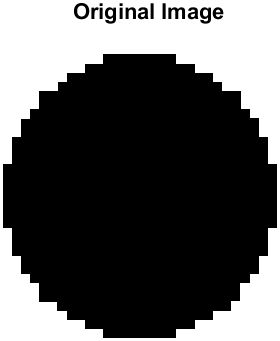
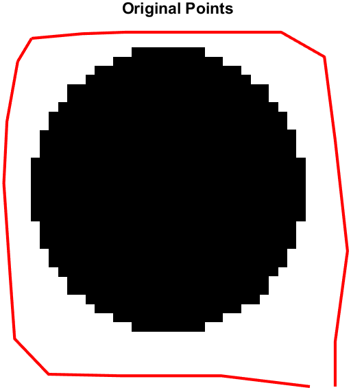
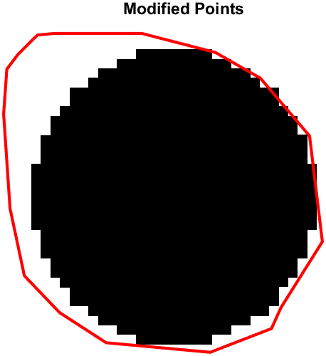

Sure, here's the updated README with the populated results section and appropriate disclaimers:

---

# Iterative Active Contour Algorithm

This MATLAB script implements an iterative active contour algorithm to segment objects in images.

## Instructions

1. **Read in an Image**: Load an image (a synthesized image is provided).
2. **Manually Select Initial Points**: Manually select initial points along the object boundary.
3. **Run the Iterative Active Contour Algorithm**: Execute the iterative active contour algorithm until convergence.

## Usage

1. Clone this repository.
2. Ensure MATLAB is installed on your system.
3. Place the image you want to process in the same directory as the script.
4. Modify the script to specify the image path if necessary.
5. Run the script in MATLAB.

## Description

- The script first loads an image using the `imread()` function and displays it using `imshow()`.
- It then prompts the user to manually select initial points along the object boundary using the `impoly()` function.
- After collecting the initial points, the script executes the iterative active contour algorithm implemented in the `SnakeAlgorithm` function.
- The algorithm iteratively refines the points to converge on the object boundary.
- The final set of points representing the segmented object boundary is visualized along with the initial points.

## Results

### Original Image
 
*Description: This is the original image of a circle. The user is supposed to pick points around the boundary of this circle.*

### Selected Points Around Circle
 
*Description: This image shows an example of initial points selected by the user along the boundary of the circle.*

### Converged Circle
 
*Description: The resulting image after the iterative active contour algorithm ran. The points have converged to accurately wrap around the boundary of the circle.*

## Notes

- Experiment with different images and initial points to observe the segmentation results.
- Adjust the parameters of the SnakeAlgorithm function as needed for different images and segmentation requirements.

### Disclaimers

For better results:

- **Reduce the Termination Condition**: Make the stopping criteria stricter to ensure that the snake algorithm iterates more and converges better. This may involve increasing the number of iterations or adjusting the convergence threshold.
- **Smoothness Term Adjustments**: Adjust the weight of the smoothness term to make the points move more smoothly towards the object boundaries. This can help in achieving a more accurate segmentation, especially for objects with smoother edges.
- **Increase the Number of Initial Points**: Selecting more initial points around the object boundary can result in a better-wrapped final contour. This helps in providing the algorithm with more information about the shape of the object, leading to a more precise segmentation.

