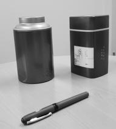

# Dijkstra's Algorithm for Image Path Finding

This MATLAB script implements Dijkstra's algorithm to find the shortest path between two points in an image.

## Instructions

- **Sample Image**: One sample image is provided, but you can also test the algorithm on your own images.
- **Select Seed and Goal Points**: Manually pick one point in the image as the seed point and another point as the target point.
- **Run Dijkstra's Algorithm**: The script will find the path between the two points with the smallest cost using Dijkstra’s algorithm and overlay it onto the image.
- **Try Different Target Points**: Experiment with different target points to observe how the algorithm works.

## How to Run

- Replace 'desk.jpg' in line 2 of the code with the path to the image you want to test.
- Run the script.

## Result and Observation

The Dijkstra's algorithm was applied to the provided image `desk.jpg` to find the shortest path between the seed point and the goal point. The seed point was manually selected as the starting point, and the goal point was selected as the destination.

| Original Image (desk.jpg)   | Result with Algorithm Applied   |
| ---                          | ---                             |
|  |  |

The algorithm successfully finds the path that connects the seed point to the goal point while navigating around the objects present in the image. However, the effectiveness of the algorithm may vary depending on the complexity of the image and the chosen points. Further experimentation with different images and points may yield varying results.

## Usage

1. Clone this repository.
2. Ensure MATLAB is installed on your system.
3. Place the image you want to process in the same directory as the script.
4. Modify the script to specify the image path if necessary.
5. Run the script in MATLAB.

## Notes

- Adjust parameters and try different images to observe varying results.
- The algorithm may perform differently on different types of images and edge conditions.

