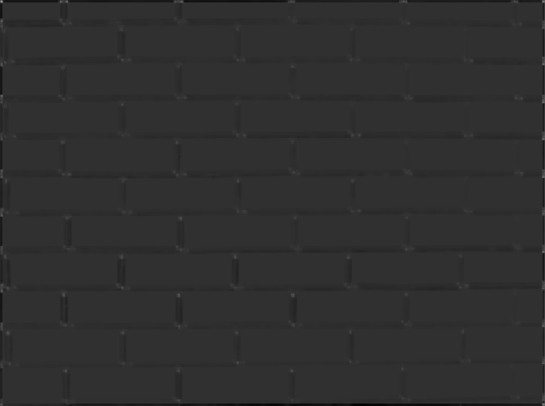
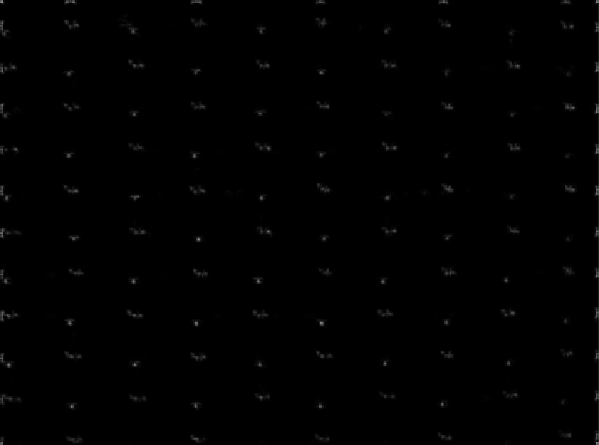
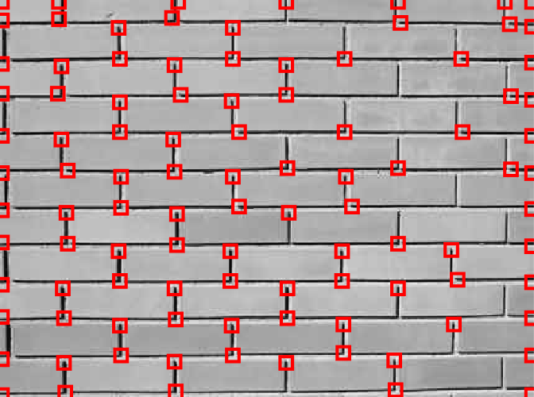
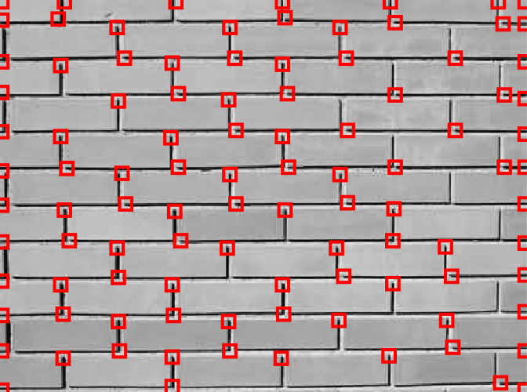
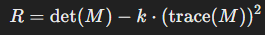

# Harris Corner Detection

This MATLAB script implements the Harris corner detection algorithm and compares it with an alternative method using eigen-decomposition.

## Instructions

- **Objective**: Detect a set of corner point features in an image using the Harris corner detection algorithm.
- **Input Parameters**:
  - `Image`: A grayscale image.
  - `Sigma`: Gaussian smoothing kernel sigma.
  - `N`: Size of the local NxN neighborhood for accumulating sums for Harris corner detection.
  - `D`: Radius of neighborhood for suppressing multiple corner responses.
  - `M`: Number of corners to detect.
- **Output Parameters**:
  - `Corners`: M*2 matrix where each row consists of [x, y] for each corner point.
  - `R`: R scores for all the pixels.
- **Steps**:
  1. Smooth the image using a Gaussian kernel with a given sigma.
  2. Compute gradient images Gx and Gy.
  3. Compute Harris corner “R” values over local neighborhoods of each pixel.
  4. Extract a sparse set of the M “best” corner features with non-maximum suppression.

## How to Run

1. Clone this repository.
2. Ensure MATLAB is installed on your system.
3. Place the image you want to process in the same directory as the script.
4. Modify the script to specify the image path if necessary.
5. Run the script in MATLAB.

## Result

The script processes the input image using two methods: the Harris Corner Method and the Eigen-Decomposition Method. It then displays and saves the results as four individual PNG files.

### Images

#### Detected Corners and R-Score Images

<table>
  <tr>
    <td style="text-align: center;">
      
      
Harris R-Score Visualization

    </td>
    <td style="text-align: center;">
      
      
Eigen R-Score Visualization

    </td>
  </tr>
  <tr>
    <td style="text-align: center;">
      
      
Harris Corners Result

    </td>
    <td style="text-align: center;">
      
      
Eigen Decomposition Result

    </td>
  </tr>
</table>

### Explanation

- **Harris Corner Method**: This method uses the Harris corner detection algorithm to identify corners in the image. It involves computing the gradient images \( Gx \) and \( Gy \), followed by the computation of Harris corner R values using the formula:

    

    Where \( M \) is a 2x2 matrix computed from the gradients. The detected corners are then marked with red boxes on the image.

- **Eigen-Decomposition Method**: This method computes the corner strength using eigenvalues of the second-moment matrix \( M \). The smaller eigenvalue is used as the corner response measure. Corners are detected similarly to the Harris method, with red boxes marking the detected corners.

### Details

- **Harris Corners Method (Top Left)**: Displays the original image with detected corners marked with red boxes.
- **Harris R-Score Method (Bottom Left)**: Displays the R-score image representing the corner response values.
- **Eigen-Decomposition Method (Top Right)**: Shows the original image with detected corners marked using the eigen-decomposition method.
- **Eigen R-Score Method (Bottom Right)**: Displays the R-score image based on the eigenvalues.

By comparing these images, you can observe the performance and differences between the two corner detection methods.

## Usage

- Adjust input parameters and experiment with different images to observe varying results.
- Visualize the R-score image to understand the corner detection results.
- The script automatically draws rectangular boxes on the detected corner points for visualization.

## Notes

- The Harris corner detection algorithm and the eigen-decomposition method may perform differently on different types of images and edge conditions.
- Experiment with different parameter values to optimize corner detection performance.

