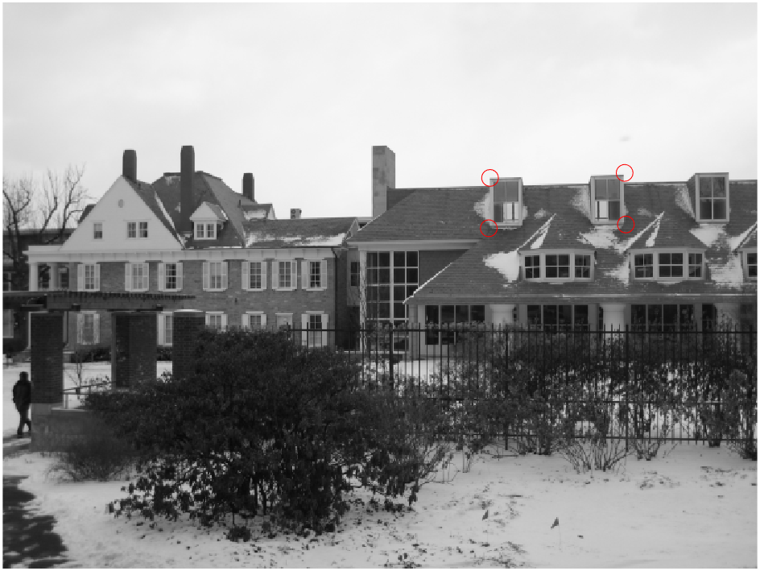

# Image Warping with Homography Matrix Estimation

This MATLAB script allows for the estimation of a homography matrix between two images and demonstrates forward and backward image warping using different interpolation methods.

## Instructions

1. **Homography Matrix Estimation (4 points)**

    - Click on N corresponding points in Image 1 and Image 2.
    - Use eigen decomposition and singular value decomposition to solve the homography transformation matrix from Image 1 to Image 2.

2. **Forward and Backward Warping (6 points)**
    - Implement forward warping using nearest neighbor interpolation.
    - Implement backward warping using different interpolation methods (nearest, bilinear, interp2).

## How to Run

1. Run the MATLAB script.
2. Click on N points in the first figure (Image 1) and press enter.
3. Click on the corresponding N points in the second figure (Image 2) and press enter.
4. Six figures will appear showing:
    - Points picked for Image 1
    - Points picked for Image 2
    - Forward warping image result
    - Backward warping (nearest) image result
    - Backward warping (bilinear) image result
    - Backward warping (interp2) image result
5. You can pre-define points1 and points2 if you don't want to click. Comment out the code sections related to picking points and uncomment the pre-defined points code.

## Results

Here are the results of the image warping process using different techniques:

<h3>Original Images and Corresponding Points</h3>
<table>
  <tr>
    <td style="text-align: center;">
      
      
Points Selected in Image 1

    </td>
    <td style="text-align: center;">
      
      
Points Selected in Image 2

    </td>
  </tr>
</table>

The original images (Image 1 and Image 2) are displayed side by side along with the corresponding points selected by the user for transformation. These points are used to generate the homography matrix.

<h3>Forward Warping</h3>
<table>
  <tr>
   <td style="text-align: center;">
      
      
Original Image 2

    </td>
    <td style="text-align: center;">
      
      
Forward Warping

    </td>
  </tr>
</table>

Forward warping is a method where each pixel in the source image (Image 1) is mapped to its corresponding location in the destination image (Image 2). This method may lead to gaps or overlaps in the resulting image.

<h3>Backward Warping (Nearest Neighbor)</h3>
<table>
  <tr>
      <td style="text-align: center;">
      
      
Original Image 2

    </td>
    <td style="text-align: center;">
      
      
Backward Warping - Nearest Neighbor

    </td>
  </tr>
</table>

Backward warping involves iterating through each pixel in the destination image (Image 2) and finding its corresponding location in the source image (Image 1). The value of the corresponding pixel in the source image is determined using the nearest neighbor interpolation method. This method can result in a less detailed resulting image

<h3>Backward Warping (Bilinear)</h3>
<table>
  <tr>
      <td style="text-align: center;">
      
      
Original Image 2

    </td>
    <td style="text-align: center;">
      
      
Backward Warping - Bilinear

    </td>
  </tr>
</table>

Backward warping with bilinear interpolation calculates the value of each pixel in the destination image (Image 2) by interpolating between the four nearest pixels in the source image (Image 1) using a weighted average.

<h3>Backward Warping (interp2)</h3>
<table>
  <tr>
      <td style="text-align: center;">
      
      
Original Image 2

    </td>
    <td style="text-align: center;">
      
      
Backward Warping - interp2

    </td>
  </tr>
</table>

Backward warping with interp2 interpolation method utilizes MATLAB's interp2 function, which performs 2-D interpolation to estimate the intensity values of pixels in the destination image (Image 2) based on the pixel values in the source image (Image 1).

## Observation

-   The accuracy of how well image 1 maps to image 2 depends on how well the points are picked 
-   The forward warping image will have black curved lines.
-   The backward warping (interp2) and backward warping (bilinear) images should look identical.

## Functions

-   `estimateHomography(pts1, pts2)`: Takes two arrays of points that map to one another and returns the homography transformation matrix.
-   `forwardWarping(im_src, H, im_dest)`: Takes the source image, H matrix, and destination image, and returns an image that is interpolated via forward warping.
-   `backwardWarping(im_src, H, im_dest, method)`: Takes the source image, H matrix, destination image, and interpolation method ('nearest', 'bilinear', 'interp2'), and returns an image that is interpolated via backward warping using one of the methods.

