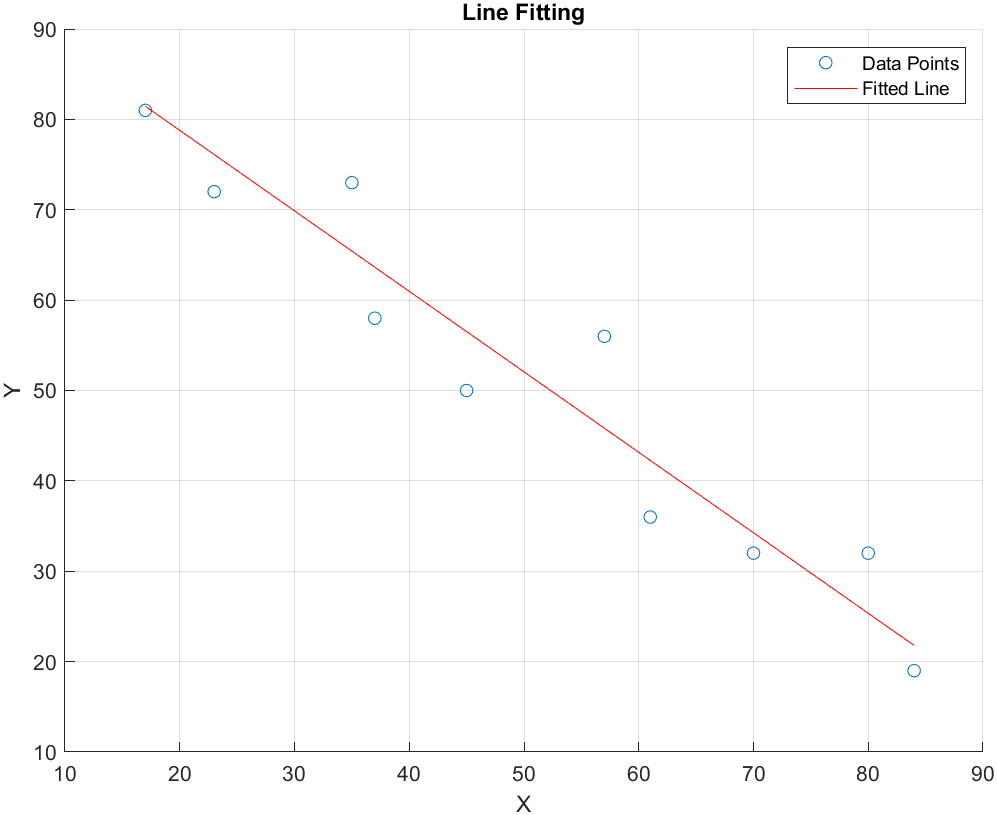

# Line Fitting with Parameter Estimation

This MATLAB script implements a line fitting algorithm to fit a general line model onto a set of given points with the constraint of a^2 + b^2 + c^2 = 1.

## Parameter Estimation (4 pts)

Given a set of points (xi, yi), i=1,...,N, the script derives the solution to the line parameters a, b, c by minimizing the error function defined as:

The solution to minimize E is obtained in the format of:

The script demonstrates the derivation steps and explains briefly how to compute the vector a, b, c based on this equation, referring to the lectures on Homography matrix computation about SVD and eigen-decomposition.

## Result

The script also includes an optional implementation bonus where it fits a line to a given set of points and visualizes the points along with the fitted line.

## How to Run

1. Run the MATLAB script.
2. View the plotted graph showing the data points and the fitted line.

## Code Explanation

- The script computes the matrix A based on the given points.
- It computes the eigenvectors and eigenvalues of A.
- The eigenvector corresponding to the smallest eigenvalue is extracted to obtain the coefficients a, b, c for the fitted line.
- Finally, the script visualizes the points and the fitted line.
