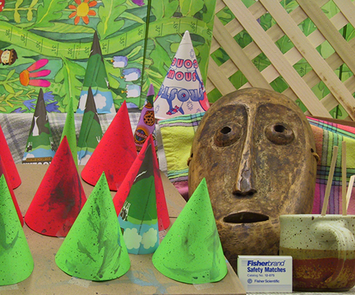
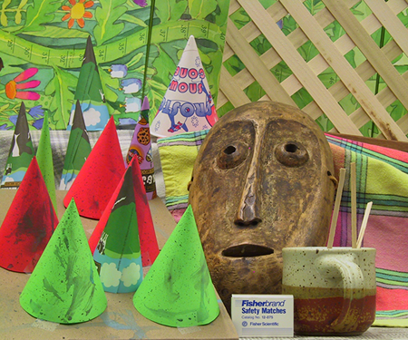
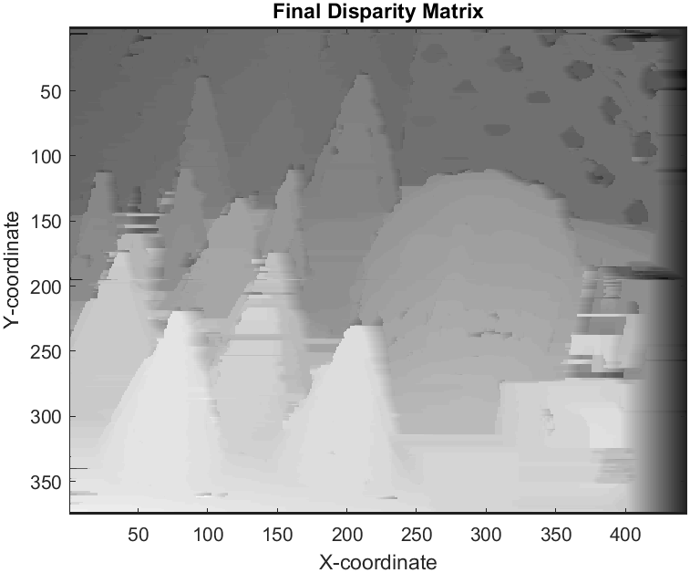

# Disparity Space Image (DSI) Computation and Stereo Reconstruction

This project involves computing the Disparity Space Image (DSI) and performing stereo reconstruction using dynamic programming.

## Instructions

1. **Read in Images**: Start by reading in two images and converting them into grayscale. Sample images are included in the provided directory. Alternatively, you can use images from the Middlebury website.

2. **Compute DSI**: Compute the DSI for each row of images using Normalized Cross Correlation (NCC).

3. **Dynamic Programming**: Apply dynamic programming on the DSI image to find the path with the minimum cost from the top-left corner to the bottom-right corner.

4. **Disparity Calculation**: Back-trace the path and compute the disparity.

5. **Repeat for Each Row**: Repeat steps 2 to 4 for each row of the image.

6. **Fill-in Occlusion**: Fill in the occlusion to complete the process.

## How to Use

1. Run the MATLAB script.

2. The script will perform DSI computation, dynamic programming, and disparity calculation automatically.

3. View the final disparity matrix to observe the stereo reconstruction results.

## Code Explanation

- The script reads in two images and converts them into grayscale.

- It then computes the DSI for each row of images using NCC.

- Dynamic programming is applied to find the minimum cost path.

- Disparity is calculated by back-tracing the path.

- The final disparity matrix is visualized to observe the stereo reconstruction.

**Note**: Due to the complexity of the algorithm, the script may take a while to finish running.

## Results

| Left Image                | Right Image                         |
|-------------------------------|----------------------------------------|
|  |  |

| Result Image                |
|-------------------------------|
|  |

